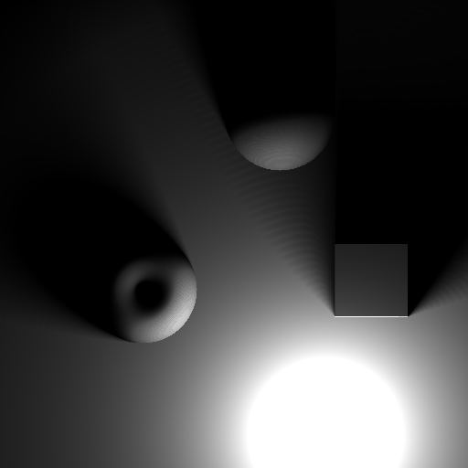

# sdftracer

Simple raytracing demo based on signed distance field.

Requires:

* [glm](https://github.com/g-truc/glm)
* [stb_image](https://github.com/nothings/stb)

References:

* [http://iquilezles.org/www/articles/distfunctions/distfunctions.htm](http://iquilezles.org/www/articles/distfunctions/distfunctions.htm)
* [http://jamie-wong.com/2016/07/15/ray-marching-signed-distance-functions/](http://jamie-wong.com/2016/07/15/ray-marching-signed-distance-functions/)
* [http://www.iquilezles.org/www/articles/rmshadows/rmshadows.htm](http://www.iquilezles.org/www/articles/rmshadows/rmshadows.htm)
